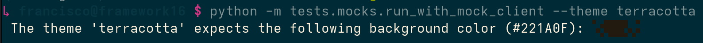

# Themes

Solveig supports theming through the `--theme` flag.
Several of the available themes are listed below, with `terracotta` being used by default.
You can disable theming with `--theme none`.

```bash
# Default theme (terracotta)
solveig -u https://localhost:5001/v1

# Select a different theme
solveig -u https://localhost:5001/v1 --theme solarized-dark

# Disable theming
solveig -u https://localhost:5001/v1 --theme none
```

### Background Color

If you use a theme (including the default one)t solveig will first print a message showing the intended
background color and the hex code:


### Available Themes

#### Terracotta


#### Forest


#### Solarized Light


#### Solarized Dark

