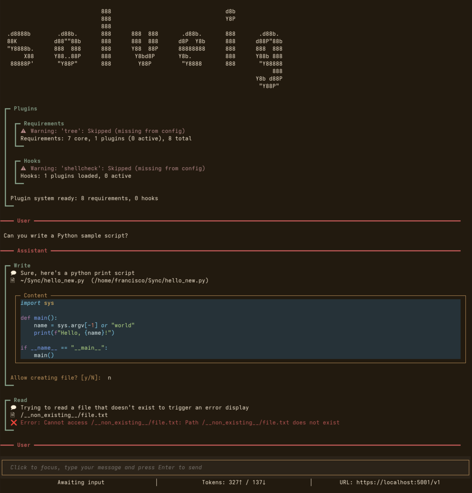

# Themes

Solveig supports theming for both the interface as well as the code linting displayed in text boxes.



### Interface

You can theme the interface using the `--theme` flag or the `theme` config option.
There are multiple themes available (`terracotta`, ``), with `terracotta` being used by default
You can disable interface theming with `--theme none`.

### Code Linting
You can theme control the theme used for code linting through the `--code-theme` flag or
the`code_theme` config options.
The themes are obtained from the Pygment project, with `material` being used by default.
You can consult their available themes [here](https://pygments.org/styles/)

###  Examples

```bash
# Select a different theme
solveig -u https://localhost:5001/v1 --theme solarized-dark --code-theme monokai

# Disable theming (code theme still uses default)
solveig -u https://localhost:5001/v1 --theme none
```