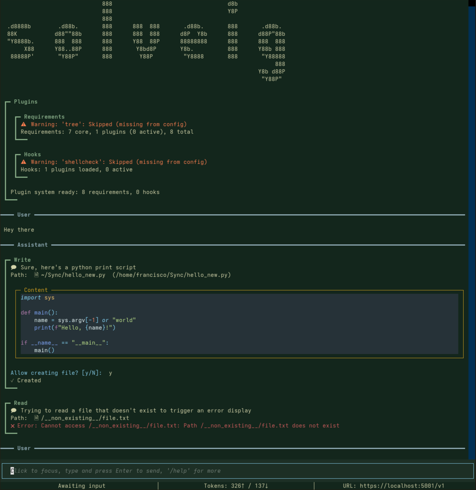

# Themes

Solveig supports theming for both the interface as well as the code linting displayed in text boxes.

## Code Linting
You can theme control the theme used for code linting through the `--code-theme` flag or
the`code_theme` config options.
The themes are obtained from the Pygment project, with `material` being used by default.
You can consult their available themes [here](https://pygments.org/styles/).

## Interface

You can select the theme used by the interface using the `--theme` flag or the `theme` config option.
There are multiple themes available that you can see below, with `terracotta` being used by default

*Note: Although theming should remain an entirely optional feature, it it currently not possible to fully
disable it, and I am looking for a solution*

## Examples

### Terracotta (with `--code-theme coffee`)

### Forest

### Midnight (with `--code-theme lightbulb`)

### Solarized Dark (with `--code-theme solarized-dark`)

### Solarized Light (with `--code-theme solarized-light`)

